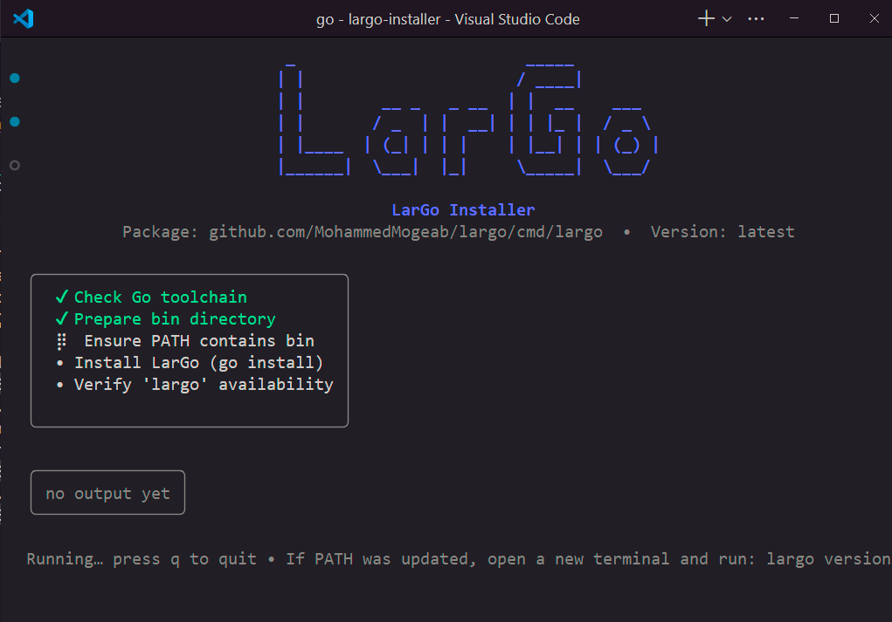

# LarGo Installer (TUI)

A cross‑platform, professional Bubble Tea UI installer for the LarGo CLI. It prepares your environment, installs the LarGo binary via `go install`, and verifies that `largo` is available.

## Features
- Clean Bubble Tea UI with centered header, step list, and live logs
- Safe PATH updates on Windows (PowerShell + registry fallback)
- PATH updates on Unix shells (adds to a shell RC file without duplicates)
- Clear status and guidance; UI stays open after completion
- Small, maintainable codebase split into `cmd/` and `internal/`

## Quick Start (from source)
- Requirements: Go 1.22+
- Fetch deps: `go mod tidy`
- Run the installer: `go run ./cmd/largo-installer`

Flags:
- `--largo-version <ver>` target LarGo version (default `latest`)
- `--module <path>` module path (default `github.com/MohammedMogeab/largo/cmd/largo`)
- `--no-color` disable colored output
- `--version` print installer version and exit

Examples:
- `go run ./cmd/largo-installer`
- `go run ./cmd/largo-installer --largo-version v0.1.0`

## What It Does
1) Checks the Go toolchain and prints its version
2) Chooses install dir: `GOBIN`, `GOPATH/bin`, or `$HOME/go/bin`
3) Ensures that directory is on PATH
   - Windows: uses PowerShell .NET APIs; falls back to `reg.exe`
   - Unix: appends an export line to the appropriate shell RC file
4) Installs LarGo via `go install <module>@<version>`
5) Verifies `largo version` via PATH or direct path

Note: If PATH was updated, open a new terminal and run `largo version`.

## Project Layout
- `cmd/largo-installer` — CLI entrypoint that parses flags and starts the UI
- `internal/ui` — Bubble Tea UI (layout, steps, logs, styling)
- `internal/install` — Installer logic and per‑OS PATH handling
- `internal/buildinfo` — Version variable set at build time with `-ldflags`

## Build
- Dev build: `go build -o bin/largo-installer ./cmd/largo-installer`
- Embed version:
  - `go build -ldflags "-s -w -X github.com/MohammedMogeab/largo-installer/internal/buildinfo.Version=$(git describe --tags --always)" ./cmd/largo-installer`

## CI & Releases
- GitHub Actions runs `tidy`, `vet`, `build`, and `test` on push/PR
- GoReleaser config (`.goreleaser.yaml`) is provided for cross‑platform builds
- Local snapshot: `goreleaser release --clean --snapshot`

## Contributing
We welcome contributions! Please see CONTRIBUTING.md for development setup, coding guidelines, and the testing checklist. A few notes:
- Keep PRs focused and small
- Prefer simple, explicit code; avoid unnecessary dependencies
- Add tests for helpers and platform‑specific logic when practical
- Be kind and constructive — see CODE_OF_CONDUCT.md

## Security
- Avoid executing shell with untrusted input; always pass arguments safely
- For security issues, please contact the maintainer privately (see Code of Conduct) instead of opening a public issue

## Roadmap
- Optional “download prebuilt binary” path (no Go toolchain needed)
- Flags: `--bin`, `--no-path`, `--use-go`, `--verbose`
- Windows: broadcast environment change so new shells see PATH immediately

## License
MIT — see LICENSE
